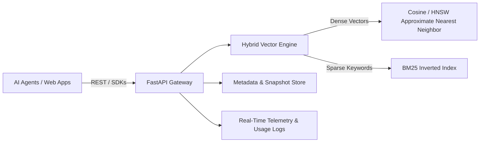

# 🧊 Iceberg Vector Database

[](https://pypi.org/project/icebergdb/)
[](https://www.npmjs.com/package/icebergdb)
[](https://opensource.org/licenses/MIT)
[](https://iceberg-backend-hrg9.onrender.com/health)
[](https://iceberg-dashboard.vercel.app)

> **High-performance, sub-20ms serverless vector database & real-time RAG engine engineered for autonomous AI agents, LLM applications, and enterprise semantic retrieval.**

Created by **Ankush** | [Official Dashboard](https://iceberg-dashboard.vercel.app) | [GitHub](https://github.com/anku5265/iceberg-database)

---

## ⚡ Quick Install

### 🐍 Python SDK
```bash
pip install icebergdb
```

```python
from iceberg import Client

client = Client(
    api_key="your_api_key",
    host="https://iceberg-backend-hrg9.onrender.com"
)

# 1. Create collection
client.create_collection("ai_knowledge")

# 2. Index text
client.index_text(
    collection="ai_knowledge", 
    text="Iceberg DB provides ultra-fast vector search for AI agents."
)

# 3. Semantic search
results = client.search(
    collection="ai_knowledge", 
    query="fast vector database for agents", 
    top_k=5
)
for r in results:
    print(f"Score: {r['score']:.4f} | Text: {r['text']}")
```

---

### 📦 JavaScript & TypeScript SDK
```bash
npm install icebergdb
```

```typescript
import { Client } from 'icebergdb'

const client = new Client({
  apiKey: 'your_api_key',
  baseUrl: 'https://iceberg-backend-hrg9.onrender.com'
})

// 1. Create collection
await client.createCollection('support_faq')

// 2. Index text
await client.indexText('support_faq', 'Iceberg DB enables real-time vector retrieval.')

// 3. Search
const matches = await client.search('support_faq', 'real-time retrieval', { topK: 5 })
console.log(matches)
```

---

## 🏛️ System Architecture



- **Hybrid Search Algorithm:** Blends dense 384-dimensional semantic embeddings with sparse BM25 keyword matching via customizable `alpha` weights.
- **Agent Long-Term Memory:** Dedicated `/memory/{agent_id}/remember` & `/memory/{agent_id}/recall` endpoints for persistent agent state.
- **Enterprise Console:** Real-time query performance telemetry, visual graph indexing, and one-click data explorer at [iceberg-dashboard.vercel.app](https://iceberg-dashboard.vercel.app).
- **Multi-Language SDKs:** Python (PyPI), JavaScript/TypeScript (NPM), Go, Rust, and .NET.

---

## 🌐 Official Deployments

| Component | Status | URL |
| :--- | :--- | :--- |
| **Cloud Dashboard** | 🟢 Live | [iceberg-dashboard.vercel.app](https://iceberg-dashboard.vercel.app) |
| **Backend REST API** | 🟢 Active | [iceberg-backend-hrg9.onrender.com](https://iceberg-backend-hrg9.onrender.com) |
| **PyPI Package** | 🟢 Live | [pypi.org/project/icebergdb](https://pypi.org/project/icebergdb/) |
| **NPM Package** | 🟢 Live | [npmjs.com/package/icebergdb](https://www.npmjs.com/package/icebergdb) |

---

## 🛡️ License

Released under the **MIT License**.  
© 2026 **Ankush** & **Iceberg Database**.
